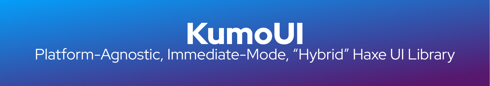
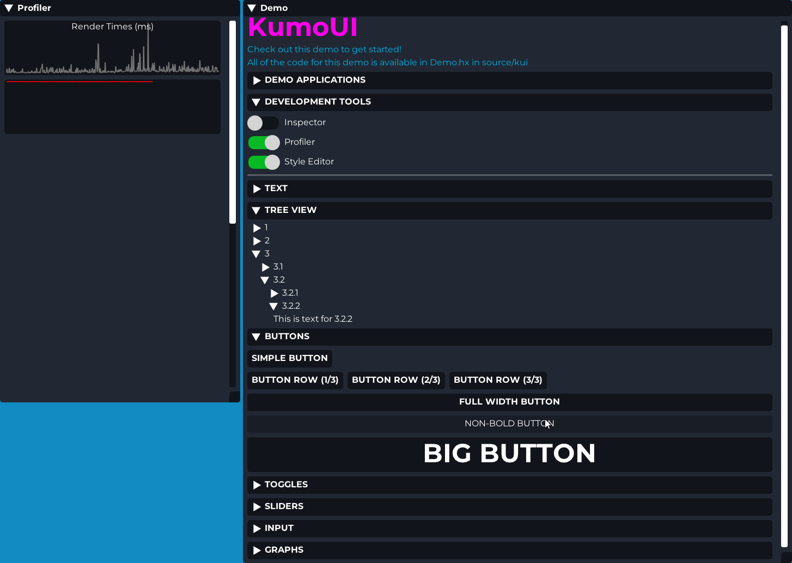
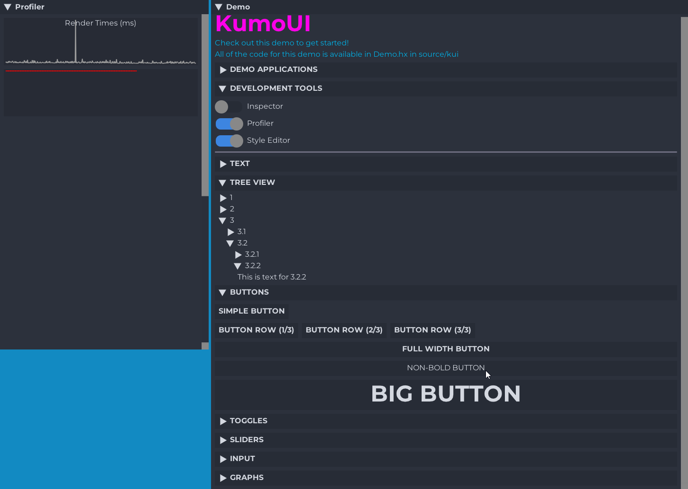
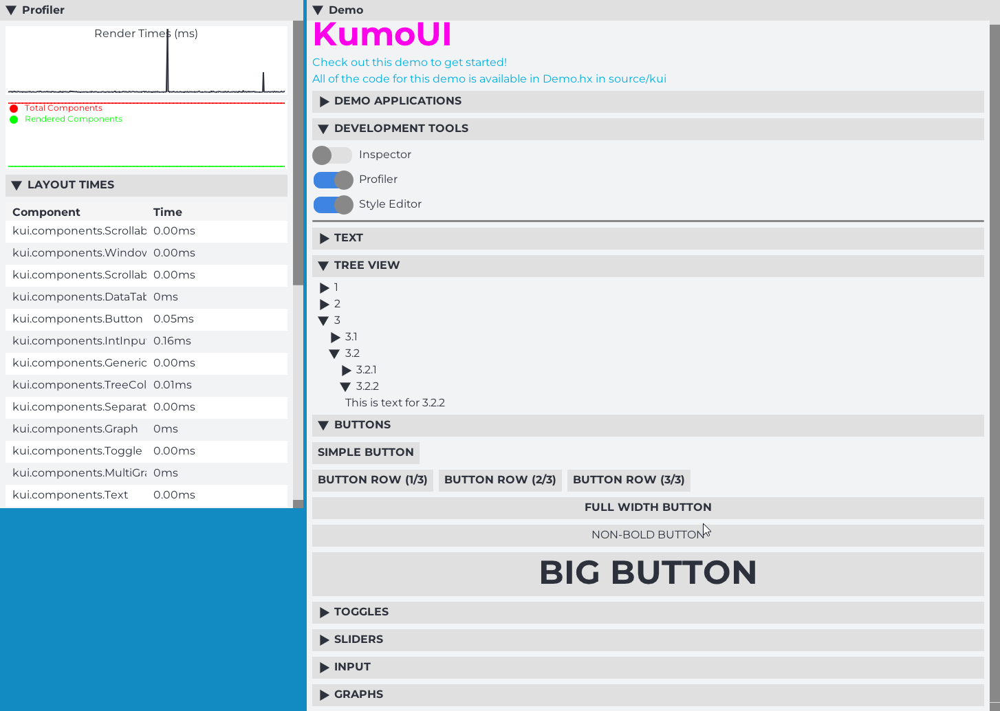

# KumoUI

Welcome to KumoUI, a super cool platform-agnostic, immediate-mode UI library for Haxe.

## How to get started
First you need to download the package, please pick a method below.

**Haxelib**  
``haxelib git kumoui https://github.com/mikaib/kumoui.git``
  
**hmm**  
``hmm git kumoui https://github.com/mikaib/kumoui.git``

After you have downloaded the package you will need to include it in your project.

**build.hxml**  
``-L kumoui``
  
**Project.xml**  
``<haxelib name="kumoui" />``

When you have successfully downloaded KumoUI, you will need to get the appropiate backend, each backend has different instructions.  
Generally you will need to initialize your backend with the needed parameters, and call the ``.begin()`` functions at the start of your frame and ``.end()`` at the end of your frame. In between these calls you may use any ``KumoUI.`` function that adds components.

### List of backends
- KawaiiFramework (included, impl/KawaiiFramework.hx)

## Hybrid
KumoUI is a "Hybrid" UI framework in an untraditional way. Normally a "Hybrid" UI framework means breaking down retained-mode structures into immediate-mode calls. KumoUI does this in the opposite way where it will try to create a retained-mode list of components from your immediate-mode calls, this has alot of advantages (and also disadvantages).

## Included components
```hx
showDemo(): Void;
separator(?color: Int, ?thickness: Int): Void;
toggle(id: String, ?labelText: String, ?value: Bool, ?labelSize: Int, ?labelColor: Int, ?labelType: FontType): Bool;
sliderFloat(id: String, ?labelText: String, ?min: Float, ?max: Float, ?value: Float, ?labelSize: Int, ?labelColor: Int, ?labelType: FontType, ?width: Float): Float;
sliderInt(id: String, ?labelText: String, ?min: Int, ?max: Int, ?value: Int, ?labelSize: Int, ?labelColor: Int, ?labelType: FontType, ?width: Float): Int;
collapse(text: String, ?id: String, ?fontSize: Int, ?fontType: FontType): Bool;
sameLine(): Void;
text(text: String, ?color: Int, ?fontSize: Int, ?fontType: FontType): Void;
button(text: String, ?fontSize: Int, ?fontType: FontType, ?fullWidth: Bool): Bool;
beginTreeNode(text: String, ?id: String, ?fontSize: Int, ?fontType: FontType): Bool; // Must always be paired with endTreeNode() even if not expanded.
endTreeNode(): Void;
graph(points: Array<Float>, width: Float, height: Float, ?labelText: String, ?labelSize: Int, ?labelType: FontType): Void;
multiGraph(pointArrays: Array<{ points: Array<Float>, ?label: String, ?color: Int }>, ?width: Float, ?height: Float): Void;
inputText(id: String, ?labelText: String, ?placeholderText: String, ?value: String, ?labelSize: Int, ?labelColor: Int, ?labelType: FontType, ?width: Float): String;
inputInt(id: String, ?labelText: String, ?placeholderText: String, ?min: Int, ?max: Null<Int>, ?value: Null<Int>, ?labelSize: Int, ?labelColor: Int, ?labelType: FontType, ?width: Float): Int;
inputFloat(id: String, ?labelText: String, ?placeholderText: String, ?min: Null<Float>, ?max: Null<Float>, ?value: Float, ?labelSize: Int, ?labelColor: Int, ?labelType: FontType, ?width: Float): Float;
table(data: TableData, ?rowHeight: Int, ?headerHeight: Int): Void;
beginContainer(?height: Float, ?width: Float, ?bgColor: Int): Void;
endContainer(): Void;
beginWindow(title: String, id: String, ?x: Float, ?y: Float, ?width: Float, ?height: Float): Void;
endWindow(): Void;
```
**Always refer to ``source/kui/demo/Demo.hx`` for reference if you don't know or understand something.**

## Themes
**Default**

  
**Material Dark**

  
**Material Light**

  
## Creating new components
To create a new component simply extend the ``Component`` class, or extend an existing component. After which you can overwrite functions from the components. Generally the life-cycle is as follows:
- ``onDataUpdate``: The component will receive the data that has been used in the call to create the component, and the component will optionally send back a response (example: button sending true when clicked)
- ``onLayoutUpdate``: The component needs to define its position and bounds, you can use calls related to the Layout System when this function is called and use it to set the required data. Optionally it can also request to be seen as a "parent container". Please look into the Text component for a simple example, while you can look into the Window, ScrollableContainer or Container example for an advanced example. It is expected you both define your position, size and clip area.
- ``onRender``: The component will need to render out to the screen, this function is only called if it is on screen (a check which is executed based on the data provided by you in the onLayoutUpdate event)

Optionally, there are also many other events that you can use:

- ``onMouseHoverEnter``: When user hovers over component (requires interactable flag)
- ``onMouseHoverExit``: When the user exits the component (requires interactable flag)
- ``onMouseClick``: When the user pressed down, and then releases their mouse over the component. (requires interactable flag)
- ``onMouseClickOutside``: When the user clicks somewhere else after having clicked on your component (used to exit input fields, alternative name would be onFocusLost) (requires interactable flag)
- ``onMouseDown``: When the mouse is clicked down. (requires interactable flag)
- ``onMouseUp``: When the mouse is released. (requires interactable flag)
- ``onDebugDraw``: When the component needs to be drawn in debug mode (By default this will draw an outline of the bounds)
- ``onDestroy``: If you use sprites in your component, you can use the constructor to create them and ``onDestroy`` to destroy them.
- ``onSerialize``: If you wish to serialize data, so that the component state gets retained even after it has been destroyed, default behaviour is to serialize the ``_data`` variable. (requires serializable flag, and an ID to be set)
- ``onDeserialize``: Combined with onSerialize, default behaviour is to pass the deserialized data to the ``onDataUpdate`` function, so often you don't need to overwrite this. (requires serializable flag, and an ID to be set)

A component has the following functions you may call:

- ``getBoundsX()`` Gives you the x-coordinate of the bounds you submitted
- ``getBoundsY()`` Gives you the y-coordinate of the bounds you submitted
- ``getBoundsWidth()`` Gives you the width of the bounds you submitted
- ``getBoundsHeight()`` Gives you the height of the bounds you submitted
- ``getClipX()`` Component's clip area X-coord.
- ``getClipY()`` Component's clip area Y-coord.
- ``getClipWidth()`` Component's clip area width.
- ``getClipHeight()`` Component's clip area height.
- ``setSerializable(_flag: Bool)`` If you want KumoUI to serialize/deserialize this component's data
- ``getId()`` Get the current component's id
- ``getPriorityWeight()`` Get the priority weight of this component
- ``setPriorityWeight(weight: Int)`` Sets the priority weight, by default this is 1, this value tells KumoUI by how much to increment the priority (z-index of sorts)
- ``setInteractable(_flag: Bool)`` Tells KumoUI if this component is interactable, if true you will receive input events, if false your input events will propogate to the next interactable component behind the current component.
- ``updateComputedPriority()`` Updates the sum of the current components, and all parents priority weight.
- ``getComputedPriority()`` Gets the sum of the current components, and all parents priority weight.
- ``setDataInteractable(data: Dynamic)`` Sets the ``_data`` variable.
- ``getDataInteractable()`` Gets the ``_data`` variable.
- ``setBoundsX(v: Float)`` Set the bounds X.
- ``setBoundsY(v: Float)`` Set the bounds Y.
- ``setBoundsWidth(v: Float)`` Set the bounds width.
- ``setBoundsHeight(v: Float)`` Set the bounds height.
- ``setId(id: String)`` Sets the component ID, by default KumoUI already does this for you. 
- ``useBoundsClipRect()`` This will set the clip region to the bounds of the component, which you often need.
- ``useScreenClipRect()`` Sets the clip rect to the entire screen.
- ``beginParentContainer()`` Tells KumoUI to mark this component as a parent container, must be matched with endParentContainer.
- ``endParentContainer()`` Ends the parent container.
- ``pointInside(x: Float, y: Float)`` check if a point is inside the visible area of the current component.
- ``setBounds(x: Float, y: Float, w: Float, h: Float)`` Sets the bounds to the given parameters.
- ``setSize(w: Float, h: Float)`` Sets the width/height of the bounds to the parameters.
- ``setPosition(x: Float, y: Float)`` Sets the bounds position to the provided coordinates.
- ``useLayoutPosition()`` Sets the bounds position to the coordinates to correct position in the layout, this is a very commonly used function.
- ``submitLayoutRequest()`` At the end of every layout update you need to submit the current bounds, you can do that using this function.
- ``submitAbsolutePositioningRequest(x: Float, y: Float, w: Float, h: Float)`` Will set the layout bounds to the provided parameters without changing the component's bounds.
- ``useParentBounds()`` will change current bounds to the one of the parent.
- ``setClipRect(x: Float, y: Float, w: Float, h: Float)`` Set the component's clip area to the provided parameters.
- ``isVisible()`` Check if any part of the component is visible.

There are also some layout functions:

- ``Layout.getScreenWidth()`` Gets the window width
- ``Layout.getScreenHeight()`` Gets the window height
- ``Layout.addHorizontalSpacing(v: Float)`` Adds horizontal spacing (used in tree nodes)
- ``Layout.addVerticalSpacing(v: Float)`` Adds vertical spacing
- ``Layout.getNextPosition()`` returns the x/y of where the component should be in the layout.
- ``Layout.getLastPosition()`` returns the position of the last component that was submitted to the layout.
- ``Layout.reset()`` Should not be called directly, this will reset the layout.
- ``Layout.beginSameLine()`` Should not be called directly, this will tell the Layout system to begin using sameLine positions.
- ``Layout.submitAbsoluteLayoutPosition(x: Float, y: Float, w: Float, h: Float)``  Will set the layout bounds to the provided parameters.
- ``Layout.submitLayoutComponent(component: Component)`` Will submit a component's bounds to the layout.
- ``Layout.beginParentContainer(component: Component)`` Will begin a parent container.
- ``Layout.endParentContainer()`` ends the current parrent container

Last but not least there are some useful functions in the KumoUI class aswell:

- ``KumoUI.init(backend: Base, debugDraw: Bool)`` Initializes KumoUI, usually called by the backend.
- ``KumoUI.drawDebuggingInformation(backend: Base)`` Draws debugging info, this is called when debugDraw is true.
- ``KumoUI.begin(sw: Float, sh: Float)`` Tells KumoUI to begin a new frame.
- ``KumoUI.render()`` Ends and renders the frame.
- ``KumoUI.getHoveredComponentAny(backend: Base, mustBeInteractable: Bool)`` Gets the currently hovered component
- ``KumoUI.getHoveredComponentOfType(backend: Base, cls: Class<?>, mustBeInteractable: Bool)`` Gets the current hovered component of type ``cls``
- ``KumoUI.getParent()`` Get the current parent container
- ``KumoUI.hasParent()`` Returns true if there is a parent container
- ``KumoUI.getParentX()`` Get parent bounds X
- ``KumoUI.getParentY()`` Get parent bounds Y
- ``KumoUI.getParentWidth()`` Get parent bounds width
- ``KumoUI.getParentHeight()`` Get parent bounds height
- ``KumoUI.getWindowPriorityWeight(component: Component)`` Gets the weighted priority for a window (to correctly sort windows based on focus and such)
- ``KumoUI.getInnerWidth()`` Get the remaining width in the parent container
- ``KumoUI.getInnerHeight()`` Get the remaining height in the parent container.
- ``KumoUI.addComponent(component: Class, data: Dynamic) -> Dynamic`` Adds a component to the UI, there are variations of this like ``addComponentInt``, ``addComponentFloat``, ``addComponentBool`` and ``addComponentString`` which have different return types.
- ``KumoUI.setDebugMode(_flag: Bool)`` Set if debug draw is enabled.

### Example component (rect component)
```hx
package kui.components;

import kui.util.TextStorage;
import kui.impl.Base;

class Rectangle extends Component {
    private var color: Int;
    private var width: Float;
    private var height: Float;

    override function onRender(impl: Base) {
        impl.drawRect(getBoundsX(), getBoundsY(), getBoundsWidth(), getBoundsHeight(), color);
    }

    override function onDataUpdate(data: Dynamic): Dynamic {
        color = data?.color ?? 0xff0000;
        width = data?.width ?? KumoUI.getInnerWidth(); // default to full width
        height = data?.height ?? KumoUI.getInnerHeight(); // default to full height

        return null; // no data returned to user
    }

    override function onLayoutUpdate(impl: Base) {
        useLayoutPosition();
        setSize(width, height);
        useBoundsClipRect();
        submitLayoutRequest();
    }
}
```

## Creating a backend
Simply extend ``source/kui/impl/Base.hx`` and implement the functions, parameters like rounding are not required. Look into the KawaiiFramework implementation for an example.

